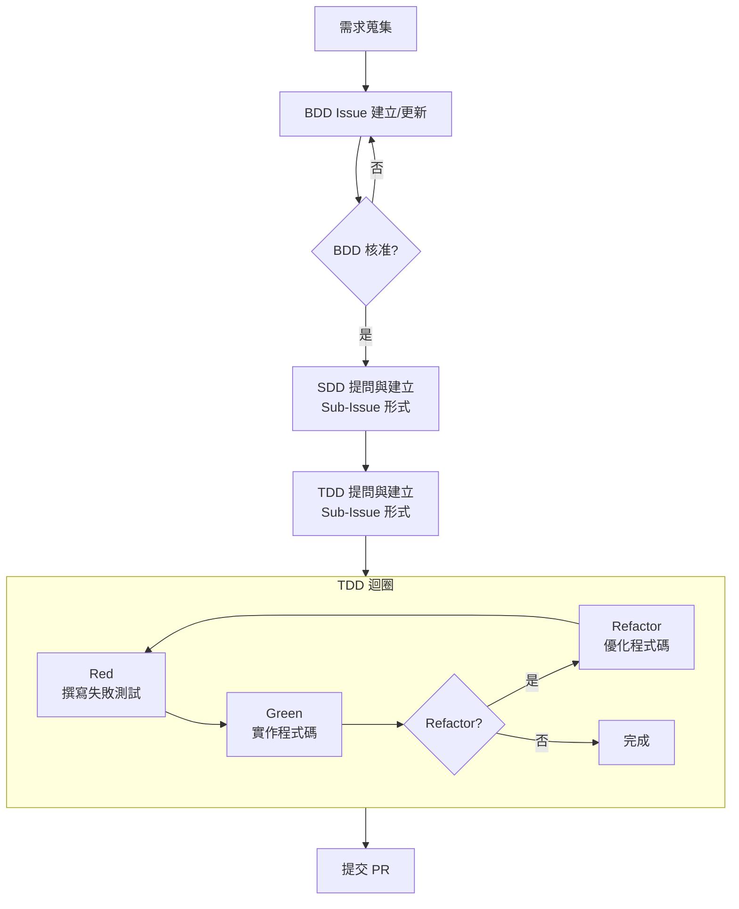

# GitHub Prompt 導覽

本目錄存放專案使用的各類 Prompt 與 Issue Template，協助 AI Agent 與開發人員在不同階段協作完成需求 → 規格 → 測試 → 實作的完整工作流。所有成果以 **GitHub Issue** 為主要交付載體，文件與程式碼 PR 為輔助。

## 流程



**核心機制**：
- 每個功能有唯一的「功能 ID」（例如 `REQ-001`）
- BDD Issue 為根源，SDD/TDD Issue 透過 Sub-Issue 自動關聯
- 所有層級共享相同的功能 ID，方便日後自動追蹤

---

## BDD、SDD、TDD 是什麼？

### BDD（Behavior-Driven Development，行為驅動開發）
- **目的**：將需求轉換為可驗收的使用者行為場景
- **核心關注**：使用者能觀察到的行為、驗收標準、Gherkin 情境
- **產出物**：BDD Issue（標題格式 `[REQ-001] - 功能名稱`）
  - User Story：「作為... 我想要... 以便...」
  - Gherkin Scenario：`Given-When-Then` 格式
  - 相關 SDD/TDD Issue 對照表

- **目的**：將 BDD 的行為轉化為具體的系統設計、介面契約、資料模型
- **前置條件**：BDD Issue 已被加上 `approved` label
- **核心關注**：API 介面、資料欄位、驗證規則、Mock 資料策略、規格合規性
- **產出物**：SDD Issue（標題格式 `S-REQ-001-US1 - 設計領域`）
  - 作為 BDD Issue 的 Sub-Issue 自動出現
  - 包含設計規格、資料模型、驗證方式、Mock 資料準備

- **目的**：透過測試驅動程式碼實作，確保品質與可回歸性
- **前置條件**：BDD Issue 已核准 + SDD Issue 已建立
- **核心關注**：測試矩陣、Red-Green-Refactor 循環、測試生命週期追蹤
- **產出物**：TDD Issue（標題格式 `T-REQ-001-US1`）
  - 作為 SDD Issue 的 Sub-Issue 自動出現
  - 包含測試矩陣、各 Test ID 的狀態追蹤（⏳ → 🔴 → 🟢 → ♻️）
  - 每個 Test 有獨立 Comment 記錄 Red/Green/Refactor 的完整生命週期

---

## Prompt 對照表

| Prompt 檔名 | 觸發條件 | 主要任務 | 產出物 |
| --- | --- | --- | --- |
| `requirements.prompt.md` | 新需求或需求分析階段 | 討論需求，蒐集背景資訊 | 結構化需求 |
| `bdd-change.prompt.md` | 需求在 BDD/SDD/TDD 中途發現變更 | 評估變更影響範圍，逐層更新 BDD/SDD/TDD Issue | 完整的變更鏈與確認表 |
| `sdd.prompt.md` | BDD Issue 已核准，需進行設計提問 | 透過提問釐清系統設計、介面契約、資料模型 | 建立 SDD Issue（自動成為 BDD 的 Sub-Issue） |
| `tdd-requirements.prompt.md` | BDD 已核准 + SDD 已建立，開始測試規劃 | 透過提問定義測試場景、資料準備、優先順序 | 建立 TDD Issue（自動成為 SDD 的 Sub-Issue） + 測試矩陣 |
| `tdd-red.prompt.md` | TDD Issue 已建立，開始 Red 階段 | 撰寫一定會失敗的測試，記錄失敗詳情 | 測試矩陣中對應 Test 狀態改為 🔴 + 獨立 Comment 記錄失敗 |
| `tdd-green.prompt.md` | Red 階段測試已建立，開始 Green 階段 | 實作最小可行程式碼讓測試通過 | 在同一 Comment 中追加 Green 階段結果，測試狀態改為 🟢 |
| `tdd-refactor.prompt.md` | Green 階段測試已通過，開始 Refactor 階段（可選） | 優化程式碼品質、提升可維護性 | 在同一 Comment 中追加 Refactor 結果，測試狀態改為 ♻️ |

---

## 工作流程範例

### 場景 1：從零開始建立新功能（US1-S1）

1. **開發人員**在 Copilot Chat 執行 `requirements.prompt.md` 並提供需求描述
2. **AI Agent** 提問、記錄、建立 BDD Issue
   - 標題：`[REQ-001] - 使用者登入`
   - 內容：User Story + Gherkin Scenario（US1-S1、US1-S2 等）
   - 初始標籤：`type: feature, domain: bdd`（無 `approved` label）

3. **PM/Reviewer** 審核並加上 `approved` label
4. **開發人員**在 Copilot Chat 執行 `sdd.prompt.md`
5. **AI Agent** 提問、記錄、建立 SDD Issue
  - 標題：`S-REQ-001-US1 - API 介面設計`
   - 自動設為 BDD Issue 的 Sub-Issue
   - 內容：API 端點、請求/回應格式、驗證規則

6. **開發人員**在 Copilot Chat 執行 `tdd-requirements.prompt.md`
7. **AI Agent** 提問、記錄、建立 TDD Issue
   - 標題：`T-REQ-001-US1`
   - 自動設為 SDD Issue 的 Sub-Issue
   - 內容：測試矩陣，包含 T-REQ-001-T-101、T-REQ-001-T-102 等 Test ID

8. **開發人員**執行 `tdd-red.prompt.md`
   - AI Agent 建立 Test Comment 記錄失敗（🔴）
   - 測試矩陣中 T-REQ-001-T-101 狀態改為 `🔴 [查看](#comment-123)`

9.  **開發人員**執行 `tdd-green.prompt.md`
    - AI Agent 在同一 Comment 追加綠燈結果（🟢）
    - 測試矩陣中狀態改為 `🟢 [查看](#comment-123)`

10. **開發人員**（可選）執行 `tdd-refactor.prompt.md`
    - AI Agent 在同一 Comment 追加優化結果（♻️）
    - 測試矩陣中狀態改為 `♻️ [查看](#comment-123)`

11. **開發人員**提交 PR，自動連結到 TDD Issue

### 場景 2：中途發現需求變更（US5-S2：SDD 層發現設計缺漏）

1. **開發人員**在 SDD 階段工作中發現設計缺漏
2. **開發人員**在 Copilot Chat 執行 `bdd-change.prompt.md`
3. **AI Agent** 評估影響範圍：
   - 判定：變更來自 SDD 層 → 需先回溯 BDD 驗證
   - 更新順序：BDD → SDD（→ 可能的 TDD）

4. **AI Agent** 逐層確認更新：
   - 先更新 BDD Issue，補充或修改 Scenario
   - **要求確認**：「BDD Issue #1 的變更是否正確？」
   - 待確認後，再更新 SDD Issue #2
   - **要求確認**：「SDD Issue #2 的變更是否正確？」
   - 最後提醒：「是否需要更新 TDD Issue #3 的測試計畫？」

5. **在各 Issue Comment 中互相引用**，建立完整變更鏈

---

## Issue 標題格式標準化

為了確保功能 ID 的自動追蹤，所有 Issue 標題都必須遵循以下格式：

| Issue 類型 | 標題格式 | 範例 |
| --- | --- | --- |
| BDD Issue | `[功能ID] - [功能名稱]` | `[REQ-001] - 使用者登入` |
| SDD Issue | `S-[功能ID]-US[序號] - [設計領域]` | `S-REQ-001-US1 - API 介面設計` |
| TDD Issue | `T-[功能ID]-US[序號]` | `T-REQ-001-US1` |

---

## 重要機制說明

### 1. 功能 ID 追蹤

- **BDD Issue** 在建立時自動指派唯一功能 ID（例如 REQ-001、REQ-002...）
- **SDD/TDD Issue** 透過 **Sub-Issue 關聯**自動繼承功能 ID
- **MCP 工具**可透過 `mcp_github_issue_read` 查詢 Parent Issue 的標題並提取功能 ID
- **優勢**：無需在 SDD/TDD 模板中手動填寫功能 ID，避免手動修改導致的追蹤錯誤

### 2. Sub-Issue 自動關聯

**建立流程**：
- 執行 `sdd.prompt.md` 建立 SDD Issue 時，**自動**透過 `mcp_github_sub_issue_write` 將其設為 BDD Issue 的 Sub-Issue
- 執行 `tdd-requirements.prompt.md` 建立 TDD Issue 時，**自動**透過 `mcp_github_sub_issue_write` 將其設為 SDD Issue 的 Sub-Issue

**結果**：
- GitHub 介面上自動顯示層級關係（BDD → SDD → TDD）
- 不需要手動在各 Issue 中填寫關聯資訊

### 3. 測試狀態追蹤機制（Per Issue #1 US3）

**測試矩陣設計**：
- 單一「狀態」欄位，每個 Test ID 一行
- 狀態單線進度：⏳（未開始）→ 🔴（失敗）→ 🟢（通過）→ ♻️（已優化）

**Comment 生命週期**：
- **Red 階段**：為每個 Test ID 建立獨立 Comment，記錄失敗訊息、重試累計、CI 連結
- **Green 階段**：在同一 Comment 中追加實作與測試通過結果
- **Refactor 階段**：在同一 Comment 中追加優化說明與驗證
- **目的**：保持 Issue 評論區清潔，每個 Test 的完整生命週期紀錄在一個 Comment 中

**Comment 必要資訊**：
- Test ID、Scenario ID
- 測試檔案路徑
- 各階段時戳（Red/Green/Refactor）
- 失敗原因（限 120 字）
- 重試累計次數
- CI/CD 執行連結

### 4. 需求變更管理（Per Issue #1 US5 + `bdd-change.prompt.md`）

**何時觸發**：開發過程中的任一階段（BDD/SDD/TDD）發現需要修改需求

**操作流程（5 大步驟）**：
1. **判定變更層級與更新順序**：根據發現位置決定回溯方向
2. **評估變更影響**：分析 BDD/SDD/TDD 各層的受影響項目
3. **建立變更方案**：整理清單、標記更新順序
4. **逐層執行同步更新**：按序更新各層級 Issue，**每層都要求人工確認**
5. **同步 Comment 與關聯**：在各 Issue Comment 中互相引用，建立完整變更鏈

**更新順序規則**：
- 在 BDD 發現 → BDD → SDD → TDD（順向更新）
- 在 SDD 發現 → SDD ← BDD（先回溯驗證）→ TDD（再更新下層）
- 在 TDD 發現 → TDD ← SDD ← BDD（全面回溯）→ SDD → TDD（依序更新）

---

## 核准機制

- **BDD Issue** 初始無 `approved` label
- **PM/Reviewer** 審核後加上 `approved` label
- **SDD Prompt** 檢查核准狀態：未核准 → 拒絕進行 SDD 提問
- **TDD Prompt** 檢查核准狀態 + SDD 建立狀態：條件不足 → 拒絕進行 TDD 提問

---

## 使用流程決策樹

```
開始
  ↓
需求說明給 AI Agent？
  ├─ 是 → 呼叫 requirements.prompt.md
  │        ↓
  │      補充背景與需求
  │        ↓
  └─ 再進入下一步
  
BDD Issue 存在？
  ├─ 否 → 呼叫 requirements.prompt.md 先建立需求摘要
  │       然後呼叫執行流程建立 BDD Issue
  │
  ├─ 是、未核准 → 等待 PM 加上 approved label
  │
  └─ 是、已核准 → 進行下一步

中途發現需要變更？
  ├─ 是 → 呼叫 bdd-change.prompt.md
  │      逐層評估 + 更新 + 人工確認
  │
  └─ 否 → 繼續

SDD Issue 存在？
  ├─ 否 → 呼叫 sdd.prompt.md（建立新的 SDD Issue）
  │
  └─ 是 → 進行下一步

TDD Issue 存在？
  ├─ 否 → 呼叫 tdd-requirements.prompt.md（建立新的 TDD Issue）
  │
  └─ 是 → 進行下一步

開始 TDD 紅綠重構循環？
  ├─ Red 階段 → 呼叫 tdd-red.prompt.md
  ├─ Green 階段 → 呼叫 tdd-green.prompt.md
  ├─ Refactor 階段（可選）→ 呼叫 tdd-refactor.prompt.md
  │
  └─ 完成 → 提交 PR
```

---

## 快速開始

1. **第一次使用？** 查看 [Issue #1](https://github.com/hsiangjenli/prompts/issues/1) 了解完整流程
2. **需要建立新功能？** 呼叫 `requirements.prompt.md` 或直接建立 BDD Issue
3. **BDD 已核准？** 呼叫 `sdd.prompt.md` 進行設計提問
4. **設計已完成？** 呼叫 `tdd-requirements.prompt.md` 開始測試規劃
5. **開始實作？** 按順序呼叫 `tdd-red.prompt.md` → `tdd-green.prompt.md` → `tdd-refactor.prompt.md`
6. **中途需要改需求？** 呼叫 `bdd-change.prompt.md` 進行評估和同步更新

## 技術棧與工具

- **互動方式**：GitHub Copilot Chat（Copilot 內建的對話介面）
- **自動化工具**：MCP（Model Context Protocol）
- **MCP 操作**：`mcp_github_issue_read`、`mcp_github_issue_write`、`mcp_github_sub_issue_write`
- **儲存位置**：所有 Prompt 自動複製到 `$HOME/Library/Application Support/Code/User/prompts/`

## 更新測試 Prompt 至 GitHub Copilot

```shell
cp -r ./prompts/* "$HOME/Library/Application Support/Code/User/prompts/"
```